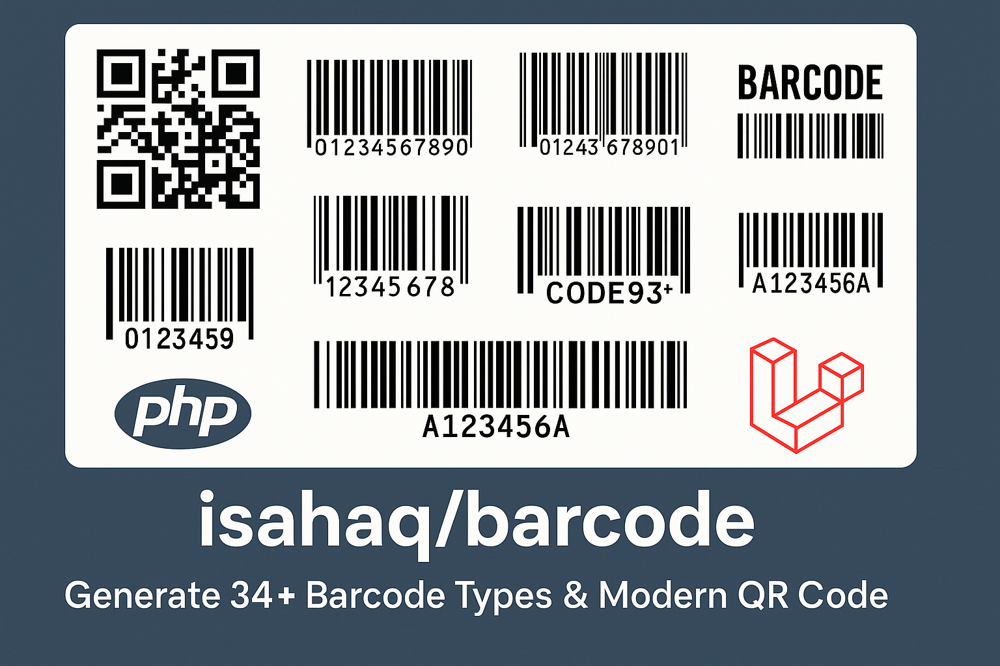

# Isahaq Barcode Generator

A universal barcode generator package supporting **32+ barcode types** (linear, 2D, postal, stacked, and auto-detection variants), multiple output formats, CLI, and full Laravel integration (Service Provider & Facade).

---

## 🚀 Features

- **32+ Barcode Types**: Linear, 2D, postal, stacked, and auto-detection variants
- **Multiple Output Formats**: PNG, SVG, HTML, JPG, PDF
- **Laravel Integration**: Service Provider and Facade support
- **CLI Tool**: Command-line interface for quick barcode generation
- **QR Code Builder**: Fluent API for advanced QR code generation
- **Validation**: Built-in data validation for different barcode types
- **Customization**: Size, colors, margins, and more options

## 📦 Installation

### Via Composer

```bash
composer require isahaq/barcode
```

### Requirements

- PHP 8.0 or higher
- ext-mbstring extension
- For Laravel: Illuminate/Support 8.0+ (automatically included)

## 🔧 Why Use This Package?

1. **Comprehensive Support**: 32+ barcode types including industry standards and auto-detection
2. **Multiple Formats**: Generate barcodes in PNG, SVG, HTML, JPG, and PDF
3. **Laravel Ready**: Seamless integration with Laravel framework
4. **CLI Support**: Generate barcodes from command line
5. **Advanced QR Codes**: Customizable QR codes with logos and labels
6. **Validation**: Built-in data validation for each barcode type
7. **Performance**: Optimized for high-volume generation
8. **Extensible**: Easy to add new barcode types and renderers

## ⚡ Laravel Setup for Older Versions

If you are using an older version of Laravel (before package auto-discovery), add the service provider and facade alias manually in your `config/app.php`:

```php
'providers' => [
    // ...
    Isahaq\Barcode\Providers\BarcodeServiceProvider::class,
],

'aliases' => [
    // ...
    'Barcode' => Isahaq\Barcode\Facades\Barcode::class,
],
```

## 📋 Supported Barcode Types (32+ Types)

### Linear Barcodes

- **Code128** (A, B, C, Auto)
- **Code39** (Standard, Checksum, Extended, Auto)
- **Code93**
- **Code25** (Standard, Auto)
- **Code32** (Italian Pharmacode)
- **Standard25** (Standard, Checksum)
- **Interleaved25** (Standard, Checksum, Auto)
- **MSI** (Standard, Checksum, Auto)

### EAN/UPC Family

- **EAN13**, **EAN8**, **EAN2**, **EAN5**
- **UPC-A**, **UPC-E**
- **ITF14**

### Postal Barcodes

- **POSTNET**, **PLANET**, **RMS4CC**, **KIX**, **IMB**

### Specialized Barcodes

- **Codabar**, **Code11**, **PharmaCode**, **PharmaCodeTwoTracks**

### 2D Matrix Codes

- **QRCode**, **DataMatrix**, **Aztec**, **PDF417**, **MicroQR**, **Maxicode**

### Stacked Linear Codes

- **Code16K**, **Code49**

---

## 🛠️ Usage

### Basic PHP Usage

```php
require_once 'vendor/autoload.php';
use Isahaq\Barcode\Types\Code128;
use Isahaq\Barcode\Renderers\PNGRenderer;
$barcodeType = new Code128();
$renderer = new PNGRenderer();
$barcode = $barcodeType->encode('1234567890');
$result = $renderer->render($barcode);
file_put_contents('barcode.png', $result);
```

### Display Barcode as Base64 Image (PNG)

```php
// ... after generating $barcode (PNG data)
$barcodeImage = base64_encode($barcode);
echo '';
//with custom height width
echo '';
```

### QR Code with Logo and Watermark

```php
use Isahaq\Barcode\QrCodeBuilder;

$qrCode = QrCodeBuilder::create()
    ->data('https://example.com')
    ->size(300)
    ->margin(10)
    ->foregroundColor([0, 0, 0])
    ->backgroundColor([255, 255, 255])
    ->logoPath('path/to/logo.png') // Logo in the center
    ->label('Scan me!')            // Watermark or label below
    ->labelFont('path/to/font.ttf', 16)
    ->format('png')
    ->build();

// Save to file
$qrCode->saveToFile('qr-code-with-logo.png');

// Display as base64 image
echo 'getString()) . '" alt="QR Code with Logo and Watermark" />';
```

### Using the Service Class

```php
use Isahaq\Barcode\Services\BarcodeService;
$barcodeService = new BarcodeService();
$pngData = $barcodeService->png('1234567890', 'code128');
$svgData = $barcodeService->svg('1234567890', 'ean13');
$htmlData = $barcodeService->html('1234567890', 'code39');
$options = [ 'width' => 300, 'height' => 100 ];
$customBarcode = $barcodeService->make('code128', 'png', '1234567890', $options);
```

### QR Code Builder (Advanced)

```php
use Isahaq\Barcode\QrCodeBuilder;
$qrCode = QrCodeBuilder::create()
    ->data('https://example.com')
    ->size(300)
    ->margin(10)
    ->foregroundColor([0, 0, 0])
    ->backgroundColor([255, 255, 255])
    ->logoPath('path/to/logo.png')
    ->label('Scan me!')
    ->labelFont('path/to/font.ttf', 16)
    ->format('png')
    ->build();
$qrCode->saveToFile('qr-code.png');
$dataUri = $qrCode->getDataUri();
echo "";
```

## 🎯 Laravel Integration

### Using Laravel Facade

```php
use Isahaq\Barcode\Facades\Barcode;
$barcode = Barcode::png('1234567890', 'code128');
$qrCode = Barcode::modernQr([
    'data' => 'https://example.com',
    'size' => 300,
    'margin' => 10,
    'error_correction' => 'H',
    'foreground_color' => [0, 0, 0],
    'background_color' => [255, 255, 255],
    'label' => 'Scan me!'
]);
return response($barcode)->header('Content-Type', 'image/png');
```

### QR Code with Logo (Laravel Facade)

```php
use Isahaq\Barcode\Facades\Barcode;
$qrWithLogo = Barcode::modernQr([
    'data' => 'https://example.com',
    'size' => 300,
    'margin' => 10,
    'logoPath' => 'path/to/logo.png',
    'logoSize' => 60, // Logo size as percentage (default: 60)
    'label' => 'Scan me!',
    'error_correction' => 'H' // Use H for better logo support
]);
return response($qrWithLogo)->header('Content-Type', 'image/png');
```

### Available Watermark Positions

```php
$positions = Barcode::getWatermarkPositions();
// Returns: ['top-left', 'top-right', 'bottom-left', 'bottom-right', 'center',
//           'top-center', 'bottom-center', 'left-center', 'right-center']
```

### Using Service Provider

```php
public function generateBarcode(Request $request)
{
    $barcodeService = app('barcode');
    $data = $request->input('data', '1234567890');
    $type = $request->input('type', 'code128');
    $format = $request->input('format', 'png');
    $options = [ 'width' => $request->input('width', 300), 'height' => $request->input('height', 100) ];
    $barcode = $barcodeService->make($type, $format, $data, $options);
    return response($barcode)->header('Content-Type', $this->getMimeType($format));
}
private function getMimeType($format)
{
    return match($format) {
        'png' => 'image/png',
        'svg' => 'image/svg+xml',
        'html' => 'text/html',
        default => 'image/png'
    };
}
```

### Blade Templates & Routes

```php

//with custom height width
 1,
    'height' => 40,
    'foreground_color' => [255, 0, 0], // Red
    'background_color' => [255, 255, 255], // White
    'padding' => 20
])) }}" alt="Barcode">

 'https://example.com'])) }}" alt="QR Code">

<!-- QR Code with Logo -->
 'https://example.com',
    'logoPath' => 'http://127.0.0.1:8000/assets/images/logo-dark.png',
    'logoSize' => 60,
    'error_correction' => 'H'
])) }}" alt="QR Code with Logo">
// routes/web.php
Route::get('/barcode/{data}', function ($data) {
    $barcode = Barcode::png($data, 'code128');
    return response($barcode)->header('Content-Type', 'image/png');
});
```

## 🖥️ CLI Usage

```bash
php vendor/bin/generate.php --data="1234567890" --type="code128" --format="png" --output="barcode.png"
php vendor/bin/generate.php --data="https://example.com" --type="qrcode" --format="png" --output="qr.png"
php vendor/bin/generate.php --data="1234567890" --type="ean13" --format="svg" --output="barcode.svg"
```

## 📊 Advanced Features

- **Batch Generation**
- **Custom Renderer Options**
- **Validation**
- **Auto-detection**: Use `code128auto`, `code39auto`, `code25auto`, `interleaved25auto`, `
